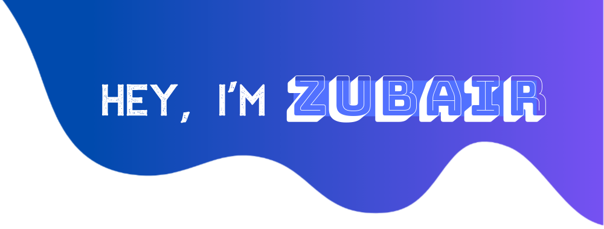

I love coding in Python :snake:. I work at [upwork](https://www.upwork.com/freelancers/~01bc4409dfe41a26fa) as a Python Developer and occasionally participate in hackathons.

⚡ Fun fact:
- 👯 I’m looking to collaborate on projects that are using Python, Flask, FastAPI, Machine Learning and AWS Cloud Services.
- 🌱 I’m currently learning AWS ML tools and mathematics required for ML and Data Science.
- :pencil2: I Write blogs/gists on GitHub on free days.

### Let's Connect :coffee:

	
	
	
	
	

